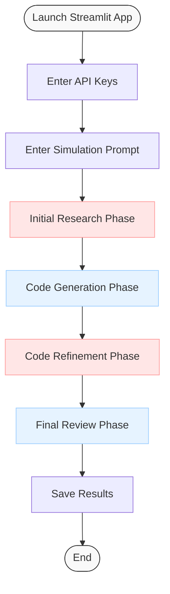
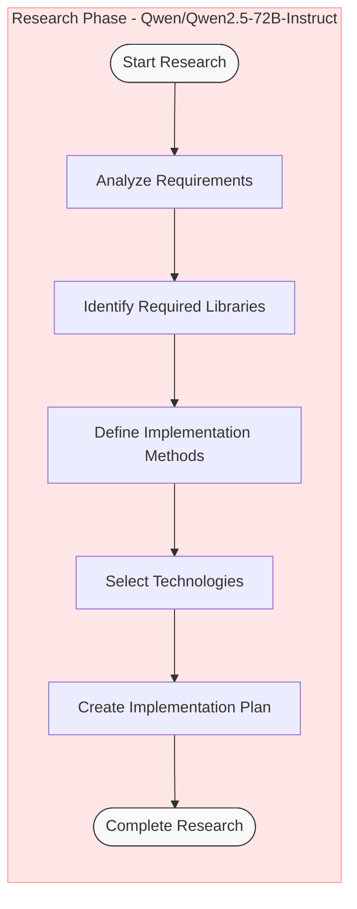
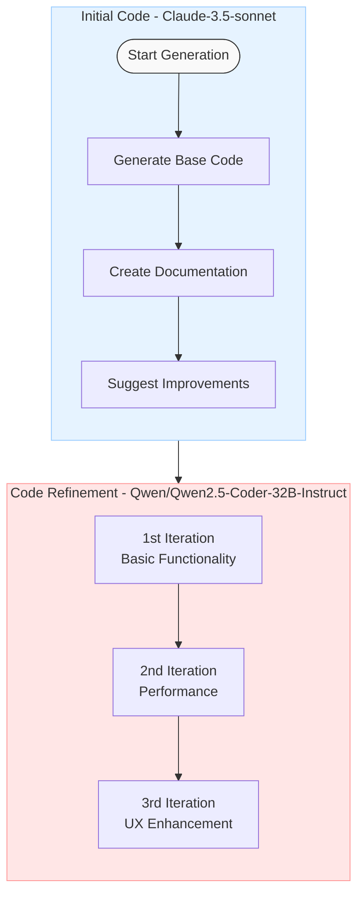
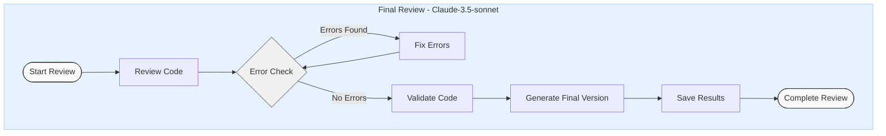

# 🧪 SIMLAB_GENERATOR

<div align="center">

[](https://github.com/Royaltyprogram/SimLab)
[](https://github.com/Royaltyprogram/SimLab_simualtions)
[](https://simlabapp.com)
[](https://twitter.com/sim_lab)


</div>

## 📌 Overview

SIMLAB_GENERATOR is a Python-based application that provides an innovative graphical user interface for simulation and laboratory tasks. It leverages the power of multiple AI models to generate and refine scientific simulations through an interactive process.

## 🔄 Process Flow

### 1. Main Process


### 2. Research Phase


### 3. Code Generation and Refinement


### 4. Final Review Phase


## 🚀 Quick Start

### Prerequisites
- Python 3.x
- pip (Python package installer)

### Installation

1️⃣ **Clone the repository**
```bash
git clone https://github.com/[your-username]/SIMLAB_GENERATOR.git
cd SIMLAB_GENERATOR
```

2️⃣ **Install dependencies**

You have several options for installing the required dependencies:

**Option 1: Using requirements.txt (Recommended)**
```bash
pip install -r requirements.txt
```

**Option 2: Manual Installation**
If you encounter any issues with requirements.txt, you can install packages individually:
```bash
# Install Streamlit
pip install streamlit
# Install OpenAI and Anthropic packages
pip install openai anthropic
```

> **Note**: If you encounter any permission errors during installation, try:
> ```bash
> pip install --user -r requirements.txt
> # or
> pip install --user streamlit openai anthropic
> ```

3️⃣ **Run the application**
```bash
streamlit run main/innovate_gui.py
```

After running the application, you can enter your OpenAI and Anthropic API keys directly in the Streamlit user interface.

## 📁 Project Structure
```
SIMLAB_GENERATOR/
├── main/
│   ├── api_calls.py          # API integration
│   ├── innovate_gui.py       # Main GUI interface
│   └── time_to_innovate.py   # Core functionality
├── .gitattributes
├── .gitignore
└── requirements.txt          # Project dependencies
```

## 🔧 Configuration

Before running the application, make sure you have all the required dependencies installed using the `requirements.txt` file. If you face any dependency conflicts, try creating a virtual environment:

```bash
# Create a virtual environment
python -m venv venv

# Activate the virtual environment
# On Windows:
venv\Scripts\activate
# On macOS/Linux:
source venv/bin/activate

# Install dependencies
pip install -r requirements.txt
```

## 🤝 Contributing
Contributions are always welcome! Please feel free to submit a Pull Request.

## 📫 Contact
- GitHub: https://github.com/Royaltyprogram/SimLab_simualtions
- Email: edulens43@gmail.com

---
